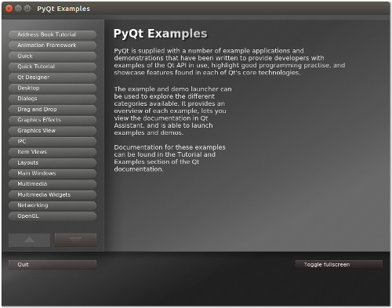

# PyQt GUI

These PyQt project show you how to create a desktop app with Python and Qt. Browse the official PyQt demos. You can run these project  yourself on Windows. All you need is Python 3. For instructions, please see [below](#running-the-examples).

## Official PyQt demos

The [PyQt source archive](https://www.riverbankcomputing.com/software/pyqt/download5) also contains a large number of sample files.. The easiest way to start them is to follow the [instructions about running examples](#running-the-examples) below.

This starts the PyQt example launcher:

<p align="center"></p>

You can use it to easily browse and run the official demo applications. The following examples are quite nice for instance:

 * Quick / Animation / ColorAnimation
 * Graphics Effects / Lighting and Shadows
 * Desktop / System Tray
 * Desktop / Screenshot
 * Widgets / Tetrix

## Running the examples

Running the examples is really easy. The only thing you need is [Python 3](https://www.python.org/downloads/).

First, download the [ZIP archive of this repository](https://github.com/sandiindika/pyqt-gui/archive/_.zip) and unpack it. Open a command prompt and use `cd` to navigate into the top-level directory of the archive.

Create a virtual environment via the command:

    python3 -m venv venv

This creates the folder `venv/` in your current directory. It will contain the necessary libraries for running the examples.

To activate the virtual environment, use the following command:

```
# On Windows:
call venv\Scripts\activate.bat
```
